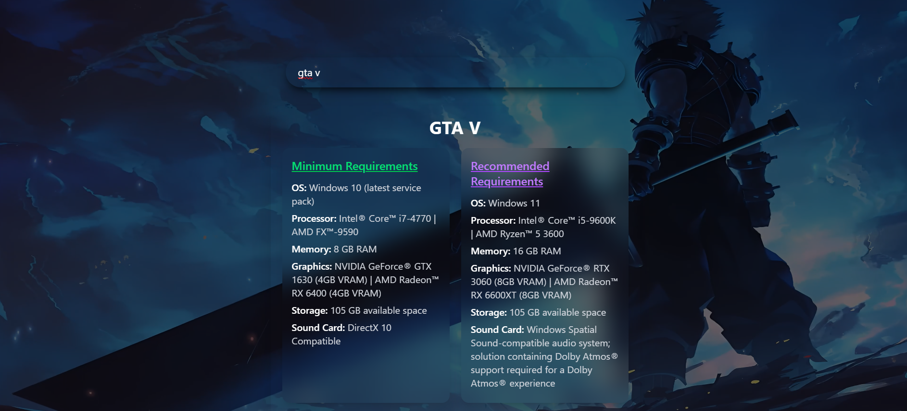
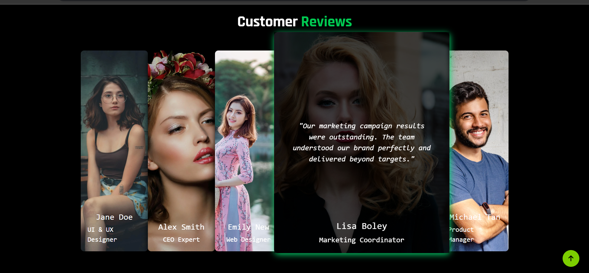

# 🎮 Gaming-Gear Hub

**Gaming-Gear Hub** is a full-stack affiliate-based web application designed to showcase and recommend gaming accessories like RAM, GPUs, keyboards, monitors, and more. It also features an AI-based **Setup Builder** and tools for calculating PC build costs and viewing recommended game setups.
 
> 🛠 Built using **React**, **Flask**, and **PostgreSQL**---

## 🧩 Project Structure
```
Gaming-Gear-Hub/
├── backend/ → Flask + PostgreSQL (venv-based API)
├── gaming-gear-admin/ → React Admin Panel (Tailwind CSS)
└── main-frontend/ → Main Website (React + Tailwind CSS)
```
---

## 📸 UI Previews

### 🖥️ Main Website Home


###🎮 Game Requirements


### 📦 Products


### ⚙️ Review Section


---

## 🚀 Features

### 👤 **User Frontend (`main-frontend/`)**
- 🧠 **Setup Builder** – Recommends best gaming build under your budget
- 💻 **Build Estimator** – Enter desired components, get estimated cost
- 🎮 **Game Requirements** – Check minimum/recommended PC specs for games like GTA V
- 🔎 **Product Search** – Filter, sort, and explore accessories
- 🔗 **Affiliate Links** – Directs users to buy from external stores
- 🌀 **Modern UI** – Includes animated cards, carousels, glowy effects, and smooth transitions

### 🛠 **Admin Panel (`gaming-gear-admin/`)**
- 📊 Dashboard showing total products and categories
- ➕ Add/Edit/Delete Products and Categories
- 🔁 Real-time API connection to backend
- 📂 Category-specific product views

### 🧠 **Backend (`Flask + PostgreSQL`)**
- 🔌 REST APIs for all CRUD operations
- 🛢️ PostgreSQL for storing product, category, and affiliate data
- 🧰 Clean code structure using Flask Blueprints (optional)
- 🧪 Built-in validation, error handling, and JSON responses

---

## 🛠 Tech Stack

| Layer        | Technology                  |
|--------------|------------------------------|
| Backend      | Python, Flask, PostgreSQL |
| Frontend     | React.js, Tailwind CSS, Vite |
| Admin Panel  | React.js, Tailwind CSS       |
| Tools Used   | dotenv, Flask-CORS |

---

## 📦 Installation Guide
### 🔹 Clone the Project

```bash
git clone https://github.com/your-username/Gaming-Gear-Hub.git
cd Gaming-Gear-Hub

Backend Setup
cd backend
python -m venv venv
venv\Scripts\activate      # Windows
# source venv/bin/activate  # macOS/Linux
pip install -r requirements.txt
python server.py

gaming-gear-admin
cd gaming-gear-admin
npm install
npm run dev

main-frontend
cd gaming-gear-admin
npm install
npm run dev

```

## 👨‍💻 Author

**Danish Shaikh**  
🎓 BCA Student | GDG Operations Head | Python & Data Enthusiast  
📧 [danish89761@gmail.com](mailto:danish89761@gmail.com)  
🔗 [LinkedIn](https://www.linkedin.com/in/danish-shaikh-b6442a212/)

---

## 📜 License

MIT License © 2025 Danish Shaikh

---

## 🏷️ Tags
`React` `Flask` `PostgreSQL` `Affiliate Marketing` `Gaming Setup` `Tailwind CSS` `Admin Panel` `Full Stack`

